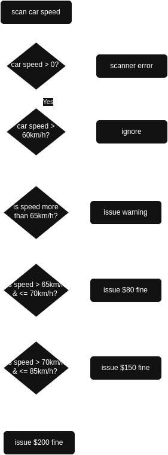
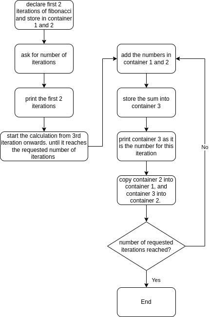

# Assignment Lab 4 - 6

## Lab 4

### Algorithm and Flowchart - Exercise 5

- Algorithm

1. scan / input car speed.
2. if car not moving more than 0km/h, return that scanner is experiencing error.
3. else if car is moving more than 80km/h issue $200 fine.
4. else if car is moving more than 70km/h issue $150 fine.
5. else if car is moving more than 65km/h issue $80 fine.
6. else if car is moving more than 60km/h issue warning.
7. else ignore.

- Flowchart



### Testing - Exercise 6

| Test # | Test Description                        | Inputs | Expected Outputs | Algorithm Output | Program success / failure |
| ------ | --------------------------------------- | ------ | ---------------- | ---------------- | ------------------------- |
| 1      | Not speeding but very close             | 59     | ignored          | ignored          | success                   |
| 2      | Speeding but only just (warning)        | 61     | warning          | warning          | success                   |
| 3      | Still speeding, but only just (warning) | 64     | warning          | warning          | success                   |
| 4      | $80 fine, but only just                 | 66     | $80 fine         | $80 fine         | success                   |
| 5      | $80 fine, but only just                 | 67     | $80 fine         | $80 fine         | success                   |
| 6      | $150 fine but only just                 | 71     | $150 fine        | $150 fine        | success                   |
| 7      | Still $150 fine but only just           | 72     | $150 fine        | $150 fine        | success                   |
| 8      | $500 fine but only just                 | 81     | $200 fine        | $200 fine        | success                   |
| 9      | null input                              |        | scanner error    | scanner error    | success                   |
| 10     | zero input                              | 0      | scanner error    | scanner error    | success                   |
| 11     | negative speed                          | -1     | scanner error    | scanner error    | success                   |
| 12     | invalid input                           | asd    | scanner error    | scanner error    | success                   |

### Programming - Exercise 7

```c

#include <stdio.h>

int main() {

  int speed = 0; // declare variable for speed

  printf("\n\n Input car speed: \t"); // tell user to input car speed

  scanf("%d", &speed); // store car speed input.

  // issue fines depending on speed
  if (speed <= 0) {
    printf("\n\t Scanner error.");
  } else if (speed > 80) {
    printf("\n\t Issue $200 fine.");
  } else if (speed > 70) {
    printf("\n\t Issue $150 fine.");
  } else if (speed > 65) {
    printf("\n\t Issue $80 fine.");
  } else if (speed > 60) {
    printf("\n\t Issue warning.");
  } else {
    printf("\n\t Ignore");
  }

  return 0;
}
```

## Lab 5

### Algorithm and Flowchart

- Algorithm

1. Declare that 0 and 1 as the first 2 iterations' set numbers. Name them container 1 and container 2.
2. Declare a variable that holds the addition of each iteration. Name this container 3.
3. Request user to input number of iterations. Must be positive integer.
4. Start a loop that adds the two declared iterations and store into container 3. Counter must start at 3 as the first 2 iterations are already established.
5. Print container 3's value for the iteration.
6. Copy container 2 into container 1 & copy container 3 into container 2.
7. Continue loop until counter reaches iteration number.

- Flowchart



### Test Cases

| Test no. | Input | Expected Output                                       | Program Output      | Result  |
| -------- | ----- | ----------------------------------------------------- | ------------------- | ------- |
| 1        | 10    | 10th iteration = 34                                   | 34                  | success |
| 2        | 5     | 5th iteration = 3                                     | 3                   | success |
| 3        | 0     | Makes user try again                                  | Try again           | success |
| 4        | -10   | Makes user try again                                  | Try again           | success |
| 5        | 90    | 90th iteration = 1779979416004714189 (sourced online) | 1779979416004714189 | success |

### Programming

```c
#include <stdio.h>

int main() {

  // declare variables
  long long container1 = 0; // set number of the first iteration
  long long container2 = 1; // set number of the second iteration
  long long container3 = 0; // stores the additions
  int iterations = 0; // stores the requested iterations
  int counter = 0;    // counter

  // prompt user to input number of iterations make sure only to accept a number bigger than 0
  while (iterations <= 0) {
    printf("\n-----FIBONACCI SEQUENCE-----\n\n");
    printf("\n How many iterations would you like?\n MUST BE HIGHER THAN 0: \t");
    scanf("%d", &iterations); //take input and store
  }

  printf("\n\n Iteration #1 : %lld", container1);
  printf("\n Iteration #2 : %lld", container2);

  // counter set as 3, as the first 2 Iterations are already set and printed.
  for (counter = 3; counter <= iterations; counter++) {
    container3 = container1 + container2;
    printf("\n Iteration #%d : %lld", counter, container3);
    container1 = container2; // copy container 2's value to container1
    container2 = container3; // copy container3's value to container2
  }

  return 0;
}
```

## Lab 6

### Algorithm & Flowchart
